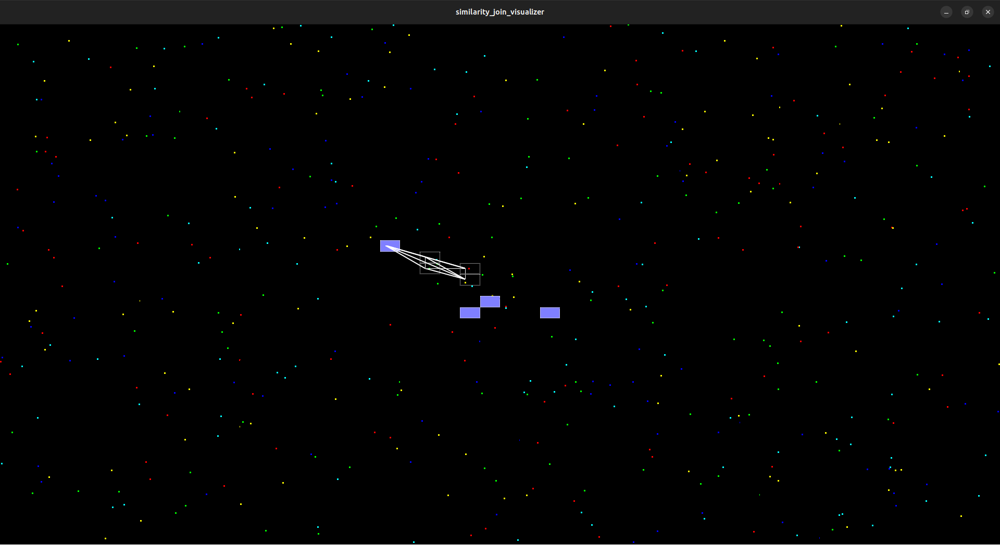

# Similarity Join Visualizer


## Introduction
A GUI application powered by [Tauri](https://v2.tauri.app/) that shows how the similarity join algorithm works step by step.<br>

## Usage
Click on the window to add a red point.<br>

## How to compile

``` npm i``` <br>
``` npm run tauri dev``` 